## Hi, I'm Florian

A software developer who cares about privacy and digital self-determination.
I love building reliable, clean systems — and doing them right.

After four years as an event technician in Dubai (where "works on my machine"
was never an option), I earned a B.Eng. in Software Engineering and now work
as a Software Engineer focused on DevOps, security, and privacy-friendly
solutions.

### Tech stack

**Languages** 
Go, PHP, JavaScript, TypeScript, Python, Bash, C++

**Frameworks** 
Symfony, Vue.js, Tailwind CSS, Cypress

**Databases** 
PostgreSQL, SQLite

**DevOps** 
Linux/Debian, Docker/Compose, Git, GitLab CI/CD, GitHub Actions, Nginx, Traefik, Proxmox, OIDC

### Find me

-  [florianhoss.de](https://florianhoss.de/)
-  [LinkedIn](https://www.linkedin.com/in/florianhoss/)
-  [Matrix](https://matrix.to/#/@flohoss:unjx.de)
-  [X / Twitter](https://x.com/flohoss/)

---

  
  

